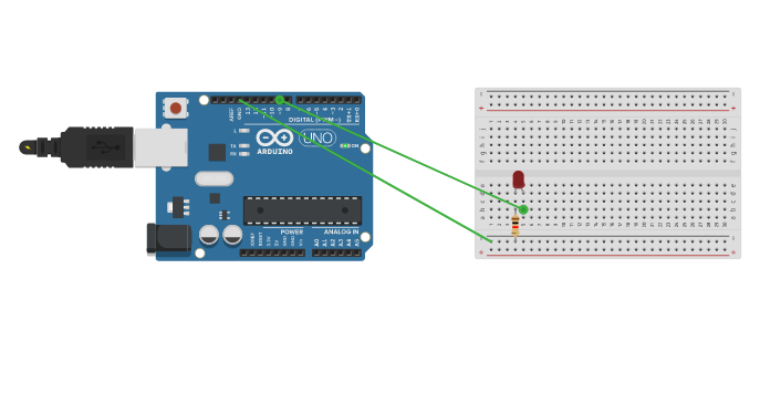

# Morse

## Description
This is a code that turns any text into morse code and uses an led as an output.

## Model

## Setup

To work on the code you can either use Arduino IDE(preffered) or Vscode 

For Vscode you will need to install an extension **vscode-arduino**

You will  be able to compile the code but you won't be able to run the code as you don't have an arduino(if you do then enjoy).
You can either use TinkerCad , where u can simulate the Arduino or you can ask me for an arduino.

### Contributer
Keshav Agrawal
